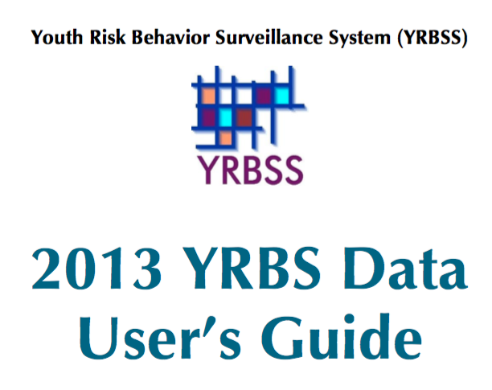
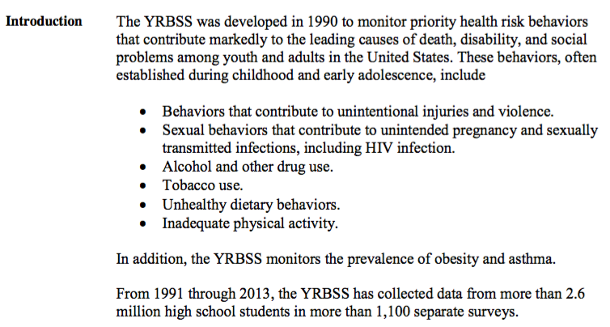
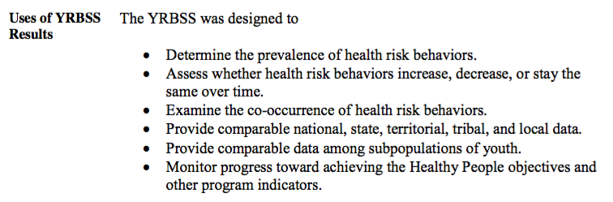

## SS 4853  

**Sampling Theory and Methods**

  

Fang He

Jan 5 2016

---

---

## Overview

---

## Goal

---

## Mission 

  

Using **linear regression** find the variables in the data file 

that best explain the variation in **BMI**. 

  

Make appropriate plots of the data.

---

## BTW

Why/When we should use linear regression?

---

## Let's have a look at all the questions

  

Since there are over 80 questions,

we are going to do a simple grouping.

---

## Let's have a look at our dataset

  

(P.S. Don't forget our mission.)

---

## Group discuss time

  

(find potential independent variables)

---

## Modeling

---

## Conclusion

---

